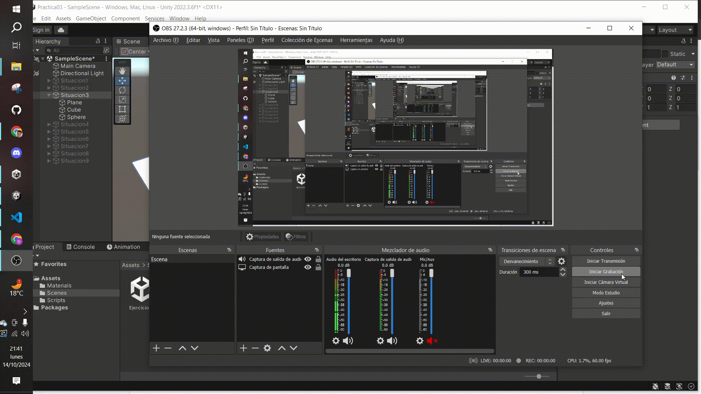

# Situaciones

## Situación 1
En esta situación, a la esfera y el plano no les afecta la gravedad, pues no tienen componente `Rigidbody`, mientras que al cubo sí. Además, gracias a que tanto el plano como el cubo tienen componente de `Collider`, el cubo no se cae, se mantiene encima del plano.

## Situación 2
Idem a la situación anterior, pero ahora la esfera tiene el mismo comportamiento que el cubo, llegando a caerse del plano.

## Situación 3
El cubo sigue teniendo el mismo comportamiento. Sin embargo, la esfera ya no cae como en la situación anterior, pues se ha activado el `IsKinematic`, por lo que su `Rigidbody` no es movido por el motor de físicas.

## Situación 4
En este caso, el motor de físicas actúa sobre todos los componentes y ninguno es cinemático, por lo que todos caen.

## Situación 5
Pasa lo mismo, todos los objetos caen, sin notarse el aumento de masa. Si el plano fuera cinemático y no cayera, se notaría mejor.

## Situación 6
Idem al anterior pero con 100.

## Situación 7
Si el plano no se pone como cinemático, ocurre lo mismo. En otro caso, ocurre lo mismo que en la situación 2 pero sin que la esfera llegue a caerse del plano gracias a la fricción que la frena.

## Situación 8
La esfera no cae, ya que no es objeto físico.

## Situación 9
La esfera cae y, como es `trigger`, traspasa el plano.

# Ejercicios

## Ejercicio 1

## Ejercicio 2

## Ejercicio 3
a) Aumenta por dos el espacio recorrido en cada frame.  
b) Ocurre lo mismo que en la situación anterior, ya que al desplazar el cubo se multiplica la dirección del vector por la velocidad (y por `Time.deltaTime`).  
c) Se disminuye el recorrido que realiza en cada frame.  
d) El movimiento del cubo comienza desde el aire.  
e) Al aplicar el movimiento relativo al sistema de referencia local, el objeto se mueve hacia donde esté mirando. Sin embargo, al aplicar el global, este cambia su posición con respecto a los ejes del mundo.

## Ejercicio 4

## Ejercicio 6

## Ejercicio 7

## Ejercicio 8

## Ejercicio 9

## Ejercicio 12

